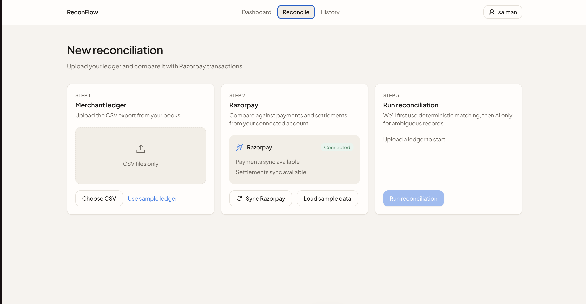

# Razorpay AI Reconciliation

An AI-assisted finance reconciliation dashboard for matching merchant ledger records with Razorpay payments and settlements. The app helps finance teams upload ledger CSVs, sync or load Razorpay transaction data, run reconciliation, and review only the exceptions that need attention.


<!--  -->

## Overview

Razorpay AI Reconciliation is built for the common finance operations problem where internal order ledgers do not perfectly line up with payment gateway exports. It combines deterministic matching rules with an AI fallback so exact matches, fee-adjusted settlements, split payments, and ambiguous records can be handled in one workflow.

The product flow is simple:

1. Sign in or create a business account.
2. Upload a merchant ledger CSV.
3. Sync Razorpay transactions or load the sample dataset.
4. Run reconciliation.
5. Review matched records, confidence scores, exceptions, and historical runs.

## Key Features

- Ledger CSV upload with accepted and rejected row tracking.
- Razorpay payments and settlements sync through Razorpay API credentials.
- Sample Razorpay and ledger data for quick evaluation demos.
- Multi-stage reconciliation engine:
  - exact order/payment matching
  - fee-aware amount matching
  - split transaction matching
  - Groq-powered AI matching for ambiguous records
  - exception classification for unresolved records
- Reconciliation dashboard with match rate, accuracy, unresolved count, and processing time.
- Run history with saved reconciliation results.
- Exception review and resolution workflow.
- Supabase authentication, business scoping, and persisted reconciliation data.

## Tech Stack

- **Framework:** Next.js 16, React 19, TypeScript
- **Database/Auth:** Supabase
- **Payments:** Razorpay Node SDK
- **AI:** Groq SDK
- **Styling:** Tailwind CSS
- **Validation:** Zod

## Project Structure

```text
app/                         Next.js app routes and API routes
components/                  UI, auth, dashboard, history, settings, reconciliation views
data/evaluation/             Synthetic Razorpay and ledger evaluation dataset
lib/reconciliation/           Matching engine, AI matcher, exception classifier, evaluation
lib/razorpay/                 Razorpay API client and normalization helpers
supabase/migrations/          Database schema
utils/supabase/               Supabase browser/server/admin clients
public/sample-ledger.csv      Demo ledger upload file
```

## Getting Started

### 1. Clone the repository

```bash
git clone https://github.com/sahilmane69/razorpay_ai.git
cd razorpay_ai
```

### 2. Install dependencies

```bash
npm install
```

### 3. Configure environment variables

Copy the example environment file:

```bash
cp .env.example .env.local
```

Fill in the required values:

```env
NEXT_PUBLIC_SUPABASE_URL=
NEXT_PUBLIC_SUPABASE_PUBLISHABLE_KEY=
SUPABASE_SERVICE_ROLE_KEY=

RAZORPAY_KEY_ID=
RAZORPAY_KEY_SECRET=

GROQ_API_KEY=
GROQ_MODEL=openai/gpt-oss-20b
```

Notes:

- Supabase variables are required for auth and database access.
- Razorpay credentials are required for live transaction sync.
- If Razorpay credentials are not configured, the app can still run with the sample dataset.
- `GROQ_MODEL` is optional and defaults to the model shown above.

### 4. Set up Supabase

Create a Supabase project and run the migration in:

```text
supabase/migrations/20260825100000_init.sql
```

This creates the core tables for businesses, ledger uploads, ledger records, Razorpay transactions, reconciliation runs, reconciliation results, linked transactions, and exceptions.

### 5. Start the development server

```bash
npm run dev
```

Open [http://localhost:3000](http://localhost:3000) in your browser.

## Demo Workflow

For a quick demo without a live Razorpay account:

1. Register or log in.
2. Go to **Run reconciliation**.
3. Click **Use sample ledger** to upload the demo CSV.
4. Click **Load sample data** or **Sync Razorpay** to seed sample Razorpay records.
5. Run reconciliation.
6. Review the results dashboard, matched transactions, exceptions, and history.

## CSV Format

The ledger upload expects a CSV file with order and amount information. A working example is available at:

```text
public/sample-ledger.csv
```

Use this file as the reference format for preparing merchant ledger exports.

## Available Scripts

```bash
npm run dev               Start the local development server
npm run build             Create a production build
npm run start             Start the production server
npm run lint              Run ESLint
npm run generate:dataset  Generate synthetic evaluation data
```

## Reconciliation Logic

The matching engine runs in stages:

1. **Exact matcher:** matches records with clear shared identifiers.
2. **Fee matcher:** handles gateway fee and tax differences between gross and net amounts.
3. **Split matcher:** detects cases where one ledger record maps to multiple Razorpay records.
4. **AI matcher:** uses Groq to reason over unresolved candidates and return confidence-backed decisions.
5. **Exception classifier:** marks remaining records for manual review with a reason.

This staged design keeps obvious matches fast and deterministic while reserving AI for the records that actually need judgment.


